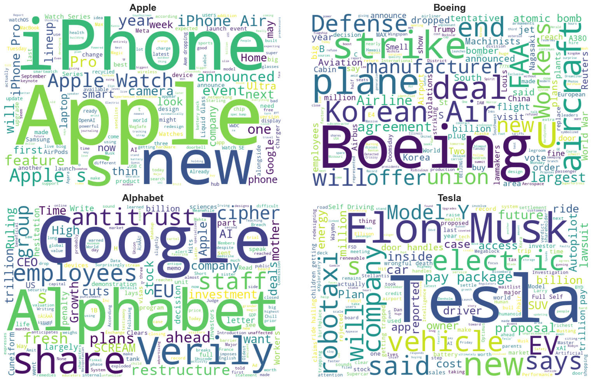

## News Sentiment Analysis Project

* Overview

This project performs Sentiment Analysis on News Articles using data collected automatically from the News API.
The main objective is to analyze sentiment trends in news coverage (positive, negative, or neutral) and gain insights into public/media perception on various topics.

### Key highlights:

* Automated data pipeline to fetch news articles via the News API.

* Preprocessing pipeline: cleaning, stopword removal, lemmatization.

* Sentiment classification.

* Data visualization to understand sentiment distribution and trends.

### Features

* Sentiment Analysis.

1. Data Collection

Automated pipeline fetches news articles from the News API for selected companies (Tesla, Alphabet, Boeing, Apple).

Data includes article titles and descriptions, stored in structured DataFrames.

2. Sentiment Analysis

Used VADER (Valence Aware Dictionary and sEntiment Reasoner) from NLTK for rule-based sentiment scoring.

For each article:

Computed title_sentiment from the English-translated title.

Computed description_sentiment from the English-translated description.

Averaged both to derive an overall sentiment score.

3. Sentiment Labeling

Based on the compound score:

Positive → score > 0

Negative → score < 0

Neutral → score = 0

# Sentiment & Market Reaction Report
## Observations

* Apple stood out with consistently positive news sentiment (+0.135 average), supported by iPhone sales and record-breaking revenues. Stock prices reflected this optimism almost instantly — same-day sentiment showed a moderate positive correlation (+0.36).

* Alphabet showed a different rhythm: although sentiment skewed positive (+0.038), the market impact appeared with a lag of two days (+0.66). The September 2025 antitrust ruling highlighted this — news of legal relief translated into a sharp rally only after investors processed the implications.

* Boeing’s sentiment leaned neutral (+0.048), but the market reacted sharply to event-driven shocks — from strikes to plane orders. Immediate sentiment correlation was moderate (+0.45), and effects lingered for a couple of days (+0.49 at lag-2).

* Tesla remained polarized: headlines bounced between high praise and criticism, creating nearly neutral average sentiment (−0.005) but with wide variance. Market correlations with sentiment were weak or negative, underscoring that investor reactions to Tesla are often personality-driven (Elon Musk) rather than sentiment-driven.

## Problems / Challenges

* Short-lived effects: For Apple, sentiment quickly gets priced in and fades, making it unreliable for medium-term predictions.

* Lagged digestion: Alphabet’s news cycle shows delayed investor reactions, complicating timing strategies.

* Event dependence: Boeing’s sentiment impact is inconsistent — routine headlines barely matter, but strikes or safety incidents trigger outsized moves.

* Sentiment disconnect: Tesla’s stock is not easily explained by sentiment scores; legal news and Musk’s persona often overshadow traditional sentiment signals.

## Suggestions

Apple: Sentiment can be used as a real-time signal but requires quick execution. For longer horizons, combine with fundamentals.

Alphabet: Apply lag-aware models, since news sentiment needs time to manifest in stock prices. This could be a strong edge for medium-term strategies.

Boeing: Build an event-detection layer (e.g., strikes, accidents, major orders) to filter impactful news from noise before linking sentiment to price.

Tesla: Pair sentiment analysis with social-media monitoring and leadership-driven signals (tweets, board decisions, legal cases), as conventional sentiment alone misses key drivers.

